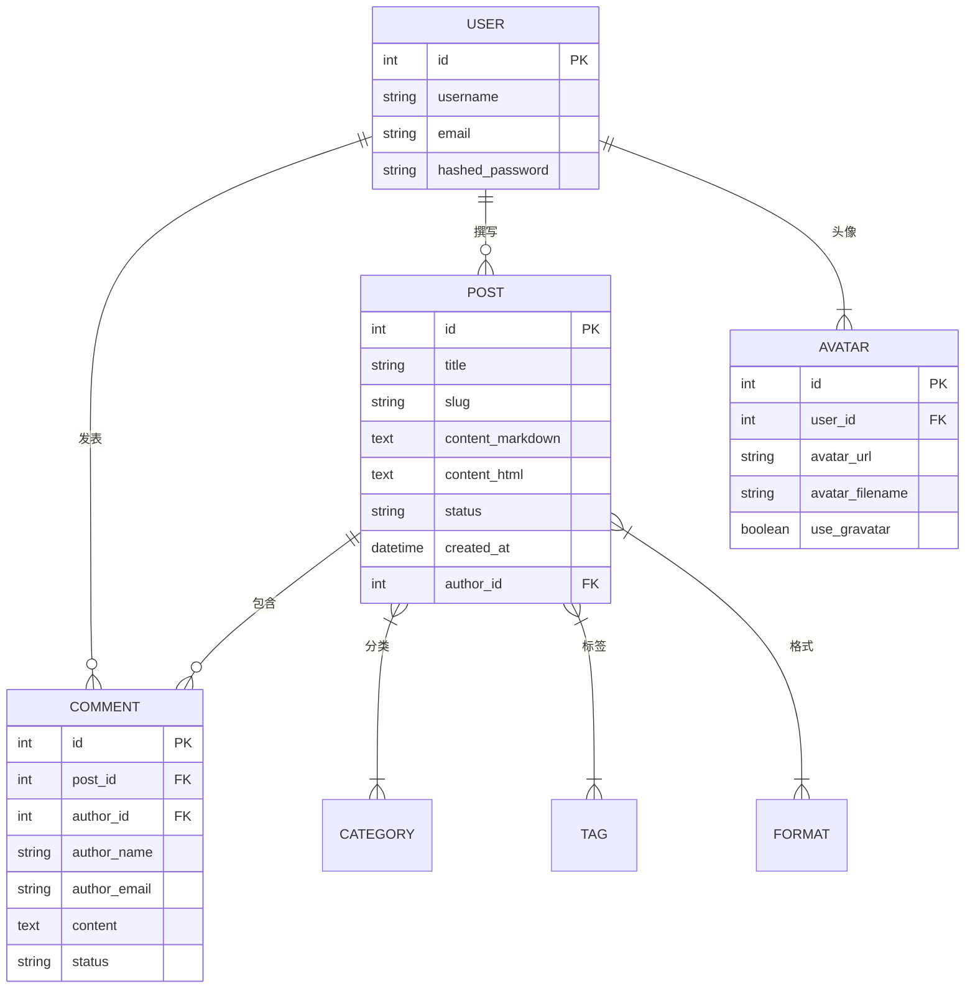

# RewrZ 开发者文档

欢迎来到 RewrZ 开发者文档！本文档将帮助您了解 RewrZ 的技术架构和开发指南。

---

## 📋 目录

1. [项目架构](#-项目架构)
2. [开发环境搭建](#-开发环境搭建)
3. [项目结构详解](#-项目结构详解)
4. [核心模块介绍](#-核心模块介绍)
5. [数据库设计](#-数据库设计)
6. [API 开发指南](#-api-开发指南)
7. [前端开发指南](#-前端开发指南)
8. [功能扩展指南](#-功能扩展指南)
9. [测试与部署](#-测试与部署)
10. [新增功能技术实现](#-新增功能技术实现)

---

## 🏗️ 项目架构

### 技术栈

```
前端层: HTMX + Tailwind CSS + Jinja2
    ↕
后端层: FastAPI + SQLAlchemy 2.0 + Pydantic  
    ↕
数据层: SQLite/PostgreSQL + Alembic
```

### 架构原则

- **分层架构**：API → CRUD → Models → Database
- **依赖注入**：松耦合的模块设计
- **类型安全**：完整的 Python 类型注解
- **RESTful API**：标准化接口设计

---

## 🔧 开发环境搭建

### 快速开始

```bash
# 1. 克隆项目
git clone https://github.com/RewrZ/RewrZ.git
cd RewrZ

# 2. 创建虚拟环境
python -m venv .venv
# Windows: .venv\Scripts\activate
# macOS/Linux: source .venv/bin/activate

# 3. 安装依赖
pip install -r requirements.txt

# 4. 配置环境变量
cp .env.example .env  # 编辑配置

# 5. 初始化数据库
python -m alembic upgrade head

# 6. 启动开发服务器
uvicorn rewrz.main:app --reload
```

### 环境变量配置

```env
# .env 文件示例
DATABASE_URL=sqlite:///./rewrz.db
SECRET_KEY=your-secret-key-here
ADMIN_PATH=/admin
MEDIA_UPLOAD_DIR=media_uploads
DEBUG=true
```

---

## 📁 项目结构详解

```
RewrZ/
├── rewrz/                    # 主应用目录
│   ├── api/                  # API 路由层
│   │   ├── auth.py          # 认证接口
│   │   ├── posts.py         # 文章接口
│   │   ├── comments.py      # 评论接口
│   │   ├── settings.py      # 设置接口
│   │   ├── avatars.py       # 头像接口
│   │   ├── error_config.py  # 错误配置接口
│   │   ├── media_settings.py# 媒体设置接口
│   │   ├── comment_settings.py # 评论设置接口
│   │   ├── system_info.py   # 系统信息接口
│   │   ├── search.py        # 搜索接口
│   │   ├── rss.py           # RSS接口
│   │   └── data_import_export.py # 数据导入导出接口
│   ├── core/                 # 核心服务层
│   │   ├── database.py      # 数据库连接
│   │   ├── config.py        # 配置管理
│   │   ├── security.py      # 安全功能
│   │   ├── media_processor.py # 媒体处理
│   │   ├── anti_spam.py     # 反垃圾评论
│   │   ├── avatar_service.py# 头像服务
│   │   ├── error_handler.py # 错误处理
│   │   ├── blog_enhancements.py # 博客增强功能
│   │   └── license_manager.py # 版权管理
│   ├── crud/                 # 数据访问层
│   │   ├── post.py          # 文章操作
│   │   ├── comment.py       # 评论操作
│   │   ├── user.py          # 用户操作
│   │   ├── category.py      # 分类操作
│   │   ├── tag.py           # 标签操作
│   │   ├── format.py        # 格式操作
│   │   ├── setting.py       # 设置操作
│   │   └── avatar.py        # 头像操作
│   ├── models/               # 数据模型层
│   │   ├── post.py          # 文章模型
│   │   ├── comment.py       # 评论模型
│   │   ├── user.py          # 用户模型
│   │   ├── category.py      # 分类模型
│   │   ├── tag.py           # 标签模型
│   │   ├── format.py        # 格式模型
│   │   ├── setting.py       # 设置模型
│   │   └── avatar.py        # 头像模型
│   ├── schemas/              # 数据验证层
│   ├── templates/            # 前端模板
│   └── main.py              # 应用入口
├── alembic/                  # 数据库迁移
├── tests/                    # 测试文件
└── requirements.txt          # 依赖配置
```

---

## 🔗 核心模块介绍

### 1. 应用入口 (main.py)

```python
from fastapi import FastAPI
from .core.config import settings

app = FastAPI(title="RewrZ")

# 动态后台路由注册
def register_admin_routes():
    admin_path = settings.ADMIN_PATH.rstrip('/')
    # 注册后台相关路由...
```

### 2. 配置管理 (core/config.py)

```python
import os
from dotenv import load_dotenv

class Settings:
    PROJECT_NAME: str = "RewrZ"
    SECRET_KEY: str = os.getenv("SECRET_KEY")
    DATABASE_URL: str = os.getenv("DATABASE_URL", "sqlite:///./rewrz.db")
    ADMIN_PATH: str = os.getenv("ADMIN_PATH", "/admin")

settings = Settings()
```

### 3. 数据库连接 (core/database.py)

```python
from sqlalchemy import create_engine
from sqlalchemy.orm import sessionmaker

engine = create_engine(settings.DATABASE_URL)
SessionLocal = sessionmaker(bind=engine)

def get_db():
    db = SessionLocal()
    try:
        yield db
    finally:
        db.close()
```

---

## 🗄️ 数据库设计

### 核心表结构



### 数据库迁移命令

```bash
# 创建迁移
alembic revision --autogenerate -m "描述"

# 应用迁移
alembic upgrade head

# 查看历史
alembic history
```

---

## 🔌 API 开发指南

### RESTful API 设计

```python
# rewrz/api/posts.py
from fastapi import APIRouter, Depends
from sqlalchemy.orm import Session
from ..core.database import get_db
from ..crud import post as crud_post

router = APIRouter()

@router.get("/posts/")
async def read_posts(db: Session = Depends(get_db)):
    return crud_post.get_posts(db)

@router.post("/posts/")
async def create_post(post: PostCreate, db: Session = Depends(get_db)):
    return crud_post.create_post(db, post)
```

### 数据验证 (schemas)

```python
# rewrz/schemas/post.py
from pydantic import BaseModel
from typing import Optional

class PostBase(BaseModel):
    title: str
    content_markdown: str
    status: str = "draft"

class PostCreate(PostBase):
    pass

class Post(PostBase):
    id: int
    slug: str
    
    class Config:
        from_attributes = True
```

---

## 🎨 前端开发指南

### HTMX 动态交互

```html
<!-- 无刷新表单提交 -->
<form hx-post="/api/comments/" hx-target="#comments">
    <textarea name="content" placeholder="发表评论"></textarea>
    <button type="submit">提交</button>
</form>

<!-- 无刷新加载更多 -->
<button hx-get="/api/posts/?page=2" 
        hx-target="#posts" 
        hx-swap="beforeend">
    加载更多
</button>
```

### Tailwind CSS 样式

```html
<!-- 文章卡片 -->
<article class="bg-white rounded-lg shadow-md p-6 mb-6">
    <h2 class="text-2xl font-bold mb-2">{{ post.title }}</h2>
    <p class="text-gray-600">{{ post.excerpt }}</p>
    <div class="flex justify-between mt-4">
        <time class="text-sm text-gray-500">{{ post.created_at }}</time>
        <a href="/posts/{{ post.slug }}" class="text-blue-600">阅读更多</a>
    </div>
</article>
```

### Jinja2 模板

```html
<!-- 基础模板 -->
 参考 官方文档
```

---

## 🔧 功能扩展指南

### 添加新功能的步骤

1. **创建数据模型**
```python
# models/newsletter.py
class Newsletter(Base):
    __tablename__ = "newsletters"
    id = Column(Integer, primary_key=True)
    email = Column(String, unique=True)
```

2. **创建数据验证**
```python
# schemas/newsletter.py
class NewsletterCreate(BaseModel):
    email: EmailStr
```

3. **添加 CRUD 操作**
```python
# crud/newsletter.py
def create_subscription(db: Session, email: str):
    subscription = Newsletter(email=email)
    db.add(subscription)
    db.commit()
    return subscription
```

4. **创建 API 路由**
```python
# api/newsletter.py
@router.post("/newsletter/")
async def subscribe(data: NewsletterCreate, db: Session = Depends(get_db)):
    return crud_newsletter.create_subscription(db, data.email)
```

5. **生成数据库迁移**
```bash
alembic revision --autogenerate -m "Add newsletter"
alembic upgrade head
```

### 扩展示例：评论点赞功能

```python
# models/comment.py
class Comment(Base):
    # ... 现有字段
    likes_count = Column(Integer, default=0)

# api/comments.py
@router.post("/comments/{comment_id}/like")
async def like_comment(comment_id: int, db: Session = Depends(get_db)):
    comment = crud_comment.get_comment(db, comment_id)
    comment.likes_count += 1
    db.commit()
    return {"likes": comment.likes_count}
```

---

## 🧪 测试与部署

### 单元测试

```python
# tests/test_posts.py
import pytest
from rewrz.crud import post as crud_post

def test_create_post(db_session):
    post_data = {"title": "测试", "content_markdown": "内容"}
    post = crud_post.create_post(db_session, post_data)
    assert post.title == "测试"
```

### 运行测试

```bash
pytest                    # 运行所有测试
pytest tests/test_api/    # 运行 API 测试
pytest --cov=rewrz       # 生成覆盖率报告
```

### 生产部署

```bash
# 使用 Gunicorn
pip install gunicorn
gunicorn rewrz.main:app --workers 4 --worker-class uvicorn.workers.UvicornWorker

# 使用 Docker
docker build -t rewrz .
docker run -p 8000:8000 rewrz
```

### Nginx 配置

```nginx
server {
    listen 80;
    server_name yourdomain.com;
    
    location / {
        proxy_pass http://127.0.0.1:8000;
        proxy_set_header Host $host;
    }
    
    location /media/ {
        alias /path/to/media_uploads/;
        expires 30d;
    }
}
```

---

## 🛠️ 开发最佳实践

### 代码规范

1. **使用类型注解**
```python
def create_post(db: Session, post: PostCreate) -> Post:
    pass
```

2. **遵循命名约定**
- 文件名：snake_case
- 类名：PascalCase  
- 函数名：snake_case
- 常量：UPPER_CASE

3. **编写清晰的注释**
```python
def generate_slug(title: str) -> str:
    """
    根据标题生成 URL 友好的别名
    
    Args:
        title: 文章标题
        
    Returns:
        URL 安全的别名字符串
    """
    pass
```

### 调试技巧

1. **使用 FastAPI 文档**：访问 `/docs` 查看 API 文档
2. **日志记录**：
```python
import logging
logger = logging.getLogger(__name__)
logger.info("调试信息")
```

3. **断点调试**：
```python
import pdb; pdb.set_trace()
```

---

## 📚 参考资源

- [FastAPI 官方文档](https://fastapi.tiangolo.com/)
- [SQLAlchemy 文档](https://docs.sqlalchemy.org/)
- [HTMX 文档](https://htmx.org/docs/)
- [Tailwind CSS 文档](https://tailwindcss.com/docs)
- [Alembic 迁移指南](https://alembic.sqlalchemy.org/)

---

## 🤝 贡献指南

1. Fork 项目到您的 GitHub
2. 创建功能分支 (`git checkout -b feature/new-feature`)
3. 编写代码并添加测试
4. 确保所有测试通过 (`pytest`)
5. 提交更改 (`git commit -m 'Add new feature'`)
6. 推送分支 (`git push origin feature/new-feature`)
7. 创建 Pull Request

---

## 🚀 新增功能技术实现

### 错误处理系统

#### 核心组件
- `core/error_handler.py`：全局错误处理模块
- `api/error_config.py`：错误配置API
- `templates/errors/`：错误页面模板

#### 技术实现
```python
# 支持FastAPI和Starlette的HTTPException
from starlette.exceptions import HTTPException as StarletteHTTPException

async def global_exception_handler(request: Request, exc: Exception):
    # 同时检查两种HTTP异常类型
    if isinstance(exc, (HTTPException, StarletteHTTPException)):
        # 处理HTTP异常
        pass
```

### 反垃圾评论系统

#### 核心组件
- `core/anti_spam.py`：反垃圾评论引擎
- `api/comment_settings.py`：评论设置API
- `templates/admin/comment_settings.html`：评论设置页面

#### 技术实现
```python
class AntiSpamEngine:
    def __init__(self, db: Session):
        self.db = db
        self.settings = self._load_settings()
    
    def evaluate_comment(self, comment_data: dict) -> SpamEvaluationResult:
        # 三层防护系统
        # 1. 无感防御（蜜罐、时间戳）
        # 2. 内容分析（链接数、关键词）
        # 3. 主动验证（验证码）
        pass
```

### 头像系统

#### 核心组件
- `core/avatar_service.py`：头像服务
- `api/avatars.py`：头像API
- `models/avatar.py`：头像数据模型

#### 技术实现
```python
class AvatarService:
    def get_avatar_url(self, user_id: int, email: str) -> str:
        # 优先级：本地头像 > Gravatar > 默认头像
        pass
    
    def generate_gravatar_url(self, email: str, size: int = 80) -> str:
        # 生成Gravatar URL
        pass
```

### 响应式图片系统

#### 核心组件
- `core/media_processor.py`：媒体处理器
- `api/media_settings.py`：媒体设置API

#### 技术实现
```python
class MediaProcessor:
    def generate_responsive_images(self, image_path: str) -> dict:
        # 生成多种尺寸的图片
        # 返回srcset和sizes属性
        pass
```

### 数据导入导出系统

#### 核心组件
- `api/data_import_export.py`：数据导入导出API
- `core/data_importer.py`：数据导入器
- `core/data_exporter.py`：数据导出器

#### 技术实现
```python
class DataExporter:
    def export_rewrz_format(self) -> dict:
        # 导出RewrZ原生格式
        pass
    
    def export_wordpress_format(self) -> str:
        # 导出WordPress兼容格式
        pass

class DataImporter:
    def import_rewrz_format(self, data: dict):
        # 导入RewrZ格式数据
        pass
    
    def import_wordpress_format(self, xml_content: str):
        # 导入WordPress格式数据
        pass
```

### 博客增强功能

#### 核心组件
- `core/blog_enhancements.py`：博客增强功能模块

#### 技术实现
```python
def calculate_reading_time(content: str) -> dict:
    # 计算阅读时间
    pass

def get_reading_progress_config() -> dict:
    # 获取阅读进度条配置
    pass

def get_related_posts(post_id: int, db: Session) -> list:
    # 获取相关文章
    pass
```

### 系统信息页面

#### 核心组件
- `api/system_info.py`：系统信息API
- `templates/admin/system_info.html`：系统信息页面

#### 技术实现
```python
def get_system_info() -> dict:
    # 获取系统信息
    return {
        "os": platform.system(),
        "python_version": platform.python_version(),
        "fastapi_version": fastapi.__version__,
        "sqlalchemy_version": sqlalchemy.__version__,
        # ... 其他信息
    }
```

---

## 📞 获取帮助

- 🐛 [报告 Bug](https://github.com/yourusername/RewrZ/issues)
- 💡 [功能建议](https://github.com/yourusername/RewrZ/discussions)
- 📖 [使用疑问](https://github.com/yourusername/RewrZ/discussions)

欢迎加入 RewrZ 开发者社区，一起打造更好的博客系统！

---

*Happy Coding! 🚀*