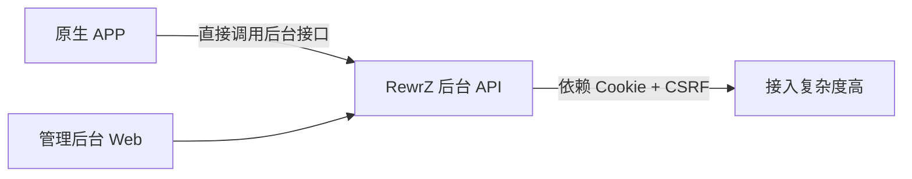
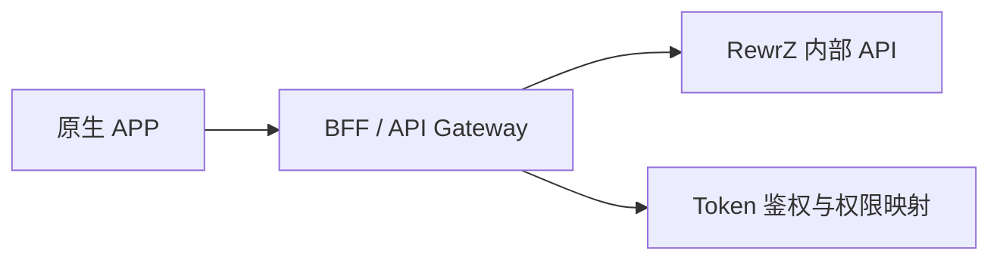

# API 与独立 APP 开发指南

你可以把 RewrZ 当作 APP 后端基础，但建议先理解当前 API 的定位。

## 1. 当前 API 能力概览

RewrZ 现有 API 大体分三类：

1. 公共读接口（前台可用）
- 搜索：`/api/v1/search`、`/api/v1/search/suggestions`
- 互动汇总：`/api/v1/reactions/summary`
- RSS/Feed：`/feed.xml`、`/rss.xml`、分类/标签/格式 feed

2. 公共写接口（受限）
- 点赞/表态：`/api/v1/reactions/like`、`/api/v1/reactions/react`
- 评论提交：`/api/v1/comments/{post_id}`（含 CSRF 与反垃圾策略）

3. 后台管理接口（强鉴权）
- 内容、媒体、分类、标签、设置、导入导出等管理能力
- 通常挂在 `{ADMIN_PATH}` 下，且写操作要求登录 + CSRF

## 2. 为什么“能做 APP”但“不能直接全量复用”

当前后台接口设计优先服务 Web 管理台：
- 认证是 Cookie 驱动
- 写操作要求 CSRF
- 管理接口路径依赖动态 `ADMIN_PATH`

这对 Web 很安全，但对原生 APP 不够友好。

### 2.1 现状数据流（Web 优先）

## 3. 推荐的 APP 接入方式

### 方案 A：BFF（推荐）
在 RewrZ 前面加一层 BFF（Backend For Frontend）：
- APP 只调用 BFF
- BFF 再调用 RewrZ 的内部 API
- 在 BFF 层做 token 颁发、权限映射、频率限制

优点：
- 不破坏现有后台安全模型
- APP 接口更稳定、可版本化

### 方案 B：在 RewrZ 内新增 APP 专用 API 组
新增如 `/api/app/v1/...`：
- 使用 Bearer Token/JWT（非 Cookie）鉴权
- 保留后台接口不变
- 对外暴露最小可用能力（列表、详情、互动、发布等）

## 4. 最小可用 APP API 设计建议

优先开放这些接口（只读优先）：
1. 文章列表/详情（分页）
2. 搜索
3. 分类/标签聚合
4. 评论列表
5. 点赞/表态

第二阶段再考虑：
1. 登录与用户中心
2. 内容发布/编辑
3. 媒体上传

## 5. 安全边界建议

- 不直接把后台管理 API 暴露给 APP。
- 不在 APP 端保存后台 Cookie。
- 所有写操作保留服务端鉴权与频率限制。
- 对导入、媒体、设置类高风险接口保持“后台专用”。

## 6. 开发落地清单

1. 先定义 APP 端需要的数据模型（卡片字段、详情字段、评论结构）
2. 设计 APP API（建议独立前缀）
3. 加鉴权方案（token + 过期策略）
4. 写回归测试（鉴权、权限、限流、参数校验）
5. 在 `CHANGELOG` 标注接口变化

## 7. 联邦化与 AI 能力对 APP 的影响（规划）

- 若未来接入联邦协议（如 ActivityPub 方向），APP 需要支持“本地数据 + 远端实体”混合展示。
- 若未来接入 AI 能力，建议由服务端统一编排（摘要、推荐、审核），APP 仅消费结果，避免端侧模型分裂。
- 这两类能力均建议先通过 BFF 暴露，减少客户端破坏性升级频率。
