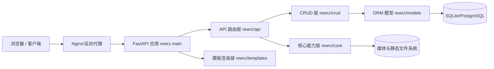
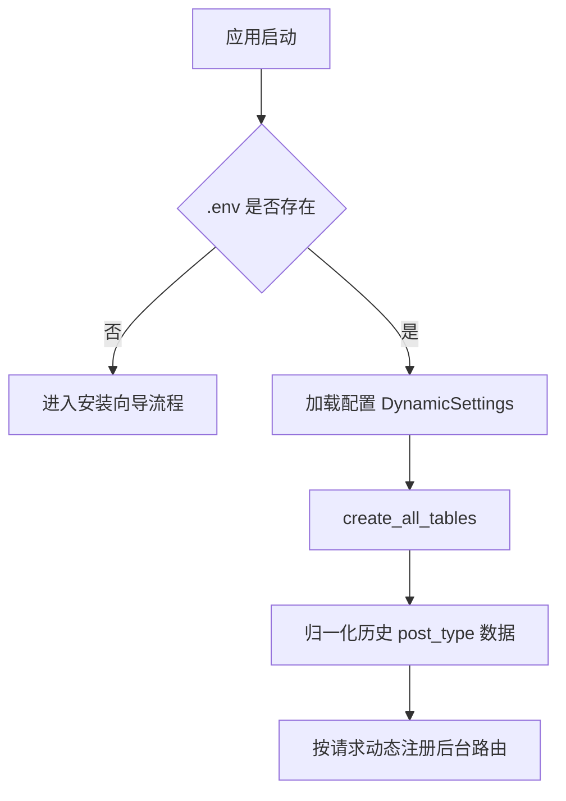
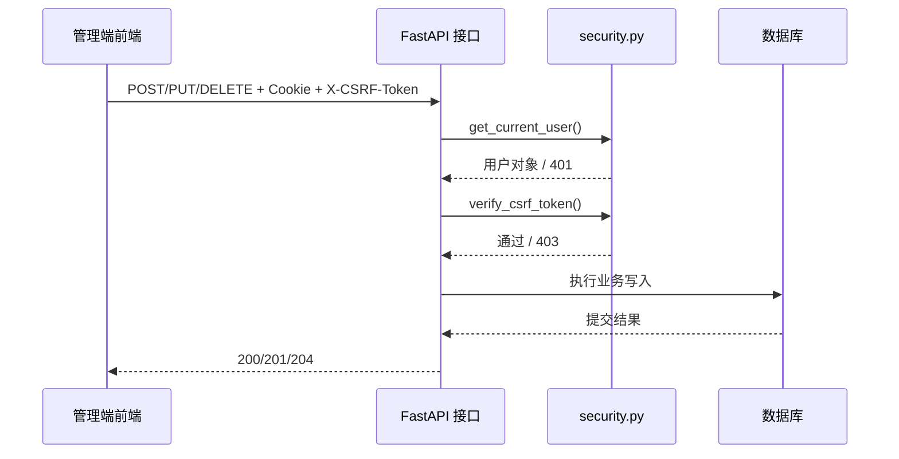
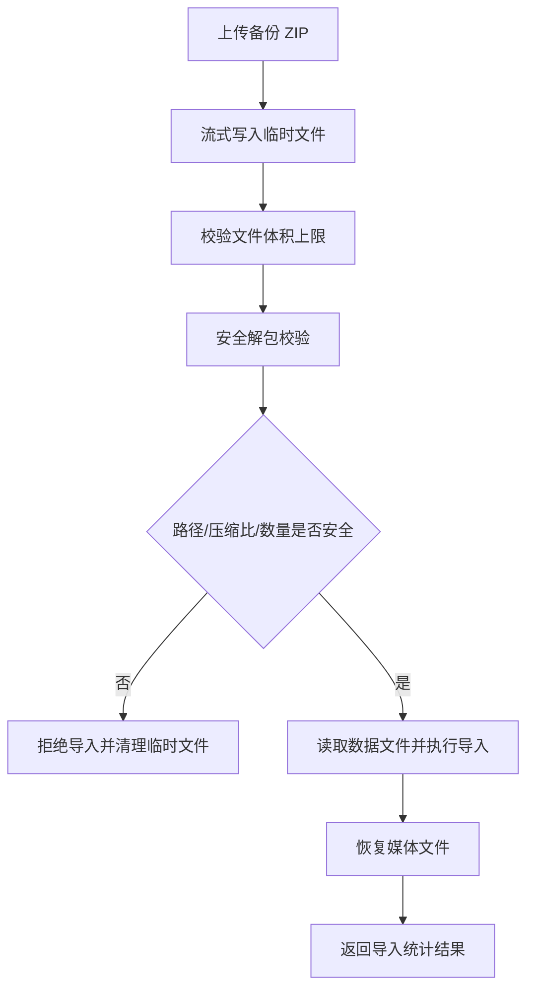
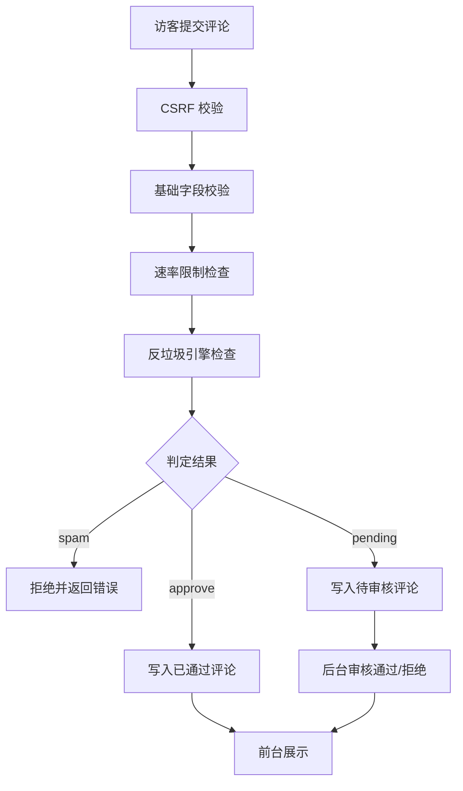
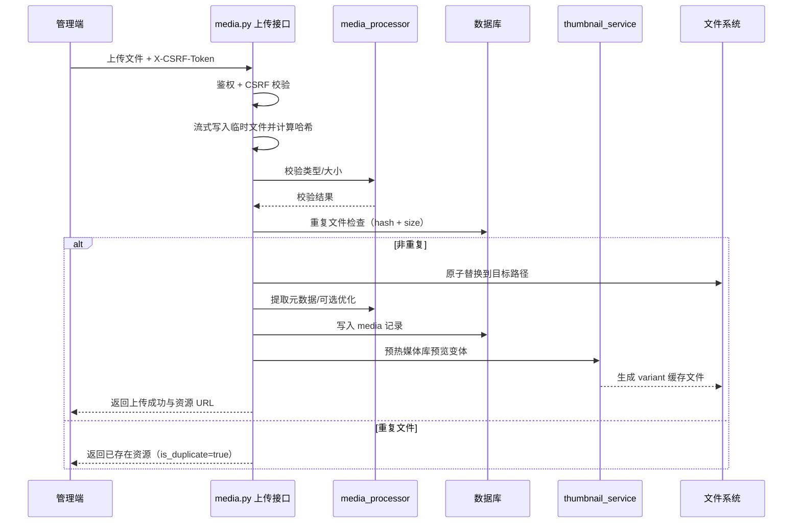

# RewrZ 架构说明

本文档描述当前代码结构、关键设计决策与扩展边界，供后续维护与二次开发参考。

## 1. 总体架构

RewrZ 采用典型分层：

1. 表现层：Jinja2 模板 + HTMX（`rewrz/templates`）
2. 接口层：FastAPI 路由（`rewrz/api` + `rewrz/main.py` 动态路由）
3. 业务/数据访问层：CRUD（`rewrz/crud`）
4. 持久层：SQLAlchemy ORM + 数据库（`rewrz/models`、`rewrz/core/database.py`）
5. 横切能力：配置、安全、模板上下文、媒体处理、导入导出（`rewrz/core`）

### 1.1 架构图（逻辑视图）

## 2. 启动与生命周期

入口文件：`rewrz/main.py`

关键流程：
- `lifespan` 启动阶段执行建表与历史数据归一化（`normalize_legacy_article_post_type`）。
- 全局关闭自动 API 文档端点（`docs_url/redoc_url/openapi_url = None`）。
- 安装状态由 `settings.installation_complete` 判定，未安装走 `/installer`。
- 安装完成后，`/installer` 对外重定向，避免后台入口暴露。

### 2.1 启动流程图

## 3. 路由组织策略

### 3.1 双路由版本策略
- 大量接口同时存在：
  - 新路径：`/api/v1/...`
  - 兼容路径：`/api/...`
- 目标是在迁移期间保留调用稳定性，最终按版本策略收敛。

### 3.2 动态后台路径
- 后台入口不写死 `/admin`，由 `ADMIN_PATH` 控制。
- 关键后台路由在运行时注册（`register_admin_routes()`），减少固定入口暴露。

### 3.3 静态与媒体路由
- `/static`：前端静态资源
- `/media`：媒体文件目录
- `/media/variant/...` 动态缩略图路由在静态挂载前定义，确保优先命中。

## 4. 数据与模型设计原则

### 4.1 内容模型硬约束
- `post_type` 仅允许：`post`、`page`
- `article/micro/poem` 作为 `formats`（内容意图）存在
- 图片/视频/音频/外链是媒体附件能力，不是主内容类型

### 4.2 关系概览
- `posts` 与 `categories/tags/formats` 为多对多关系
- `comments` 通过 `post_id` 关联文章
- `settings` 以 `key + JSON value` 存储可扩展配置
- `media` 独立存储元信息（路径、类型、大小、哈希、上传者）

详见：[`DATA_MODEL.md`](DATA_MODEL.md)

## 5. 安全架构

### 5.1 身份认证
- 管理登录成功后写入 `access_token` Cookie（JWT）。
- 受保护接口依赖 `get_current_user`。

### 5.2 CSRF
- 会话中维护 `csrf_token`。
- 后台写操作（POST/PUT/DELETE）要求 CSRF 令牌并调用 `verify_csrf_token`。

### 5.3 Cookie/Session 安全
- `should_use_secure_cookie` 根据配置与请求协议决定 `Secure`。
- `SessionMiddleware` 支持 `https_only`（由 `SESSION_HTTPS_ONLY` 控制）。

### 5.4 上传与导入防护
- 上传采用流式写入，限制大小，避免整文件读入内存。
- 备份 ZIP 导入执行路径越界、压缩比、条目数、总大小校验。

### 5.5 后台写请求安全流程

### 5.6 导入备份数据流

### 5.7 评论审核与反垃圾流程

## 6. 性能与可维护性策略

- 尽量将复杂逻辑收敛到 `core/` 或 `crud/`，避免路由层膨胀。
- 大量列表查询在 CRUD 层统一管理，减少模板层散乱查询。
- 通过测试覆盖关键行为（路由版本、模型约束、导入/上传安全、事务回归）。

### 6.1 媒体上传到变体生成时序图

## 7. 扩展建议

新增功能建议顺序：
1. 明确模型约束（是否符合 `post_type/formats` 规则）
2. 新增/调整 ORM 与 Schema
3. 在 CRUD 实现事务与行为
4. 在 API 层补鉴权与 CSRF
5. 新增回归测试
6. 更新 `docs/` 文档

## 8. 不建议做的事

- 为历史数据默认添加运行时 fallback（优先一次性迁移）
- 在核心 CRUD 内部随意 `commit` 破坏外层事务边界
- 管理写接口漏加 CSRF
- 上传/导入绕过大小与边界校验
