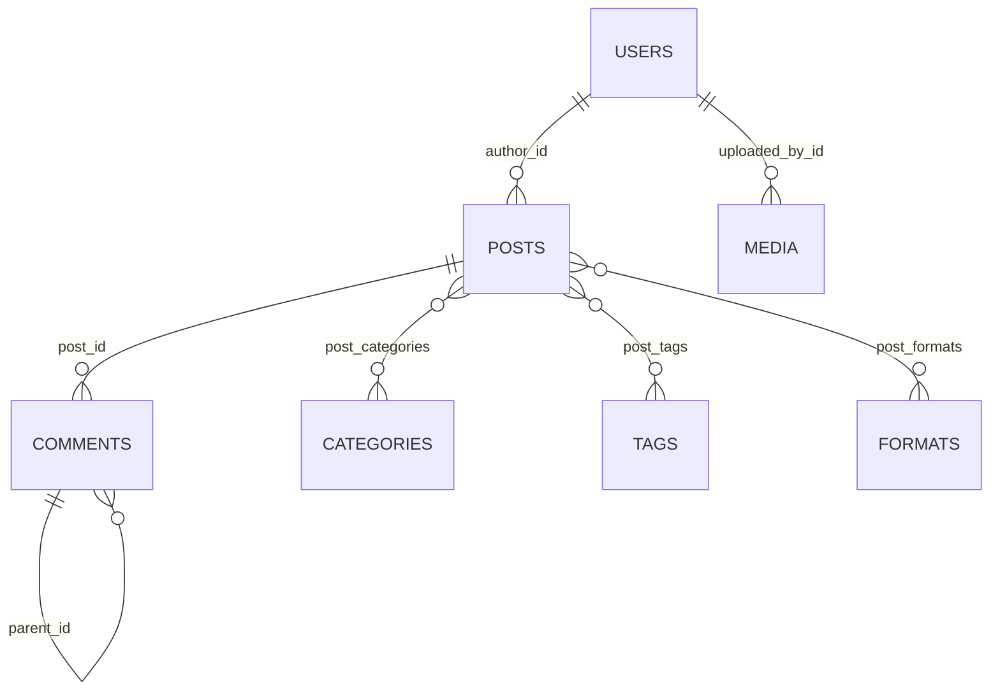
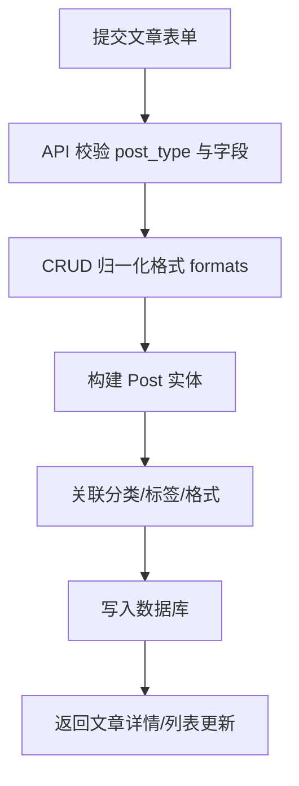

# RewrZ 数据模型说明

本文档记录核心表结构、关系与业务约束，便于后续开发和迁移。

## 1. 核心实体

| 表名 | 说明 | 关键字段 |
|---|---|---|
| `users` | 后台用户 | `id`, `username`, `email`, `hashed_password`, `role`, `token_version` |
| `posts` | 内容主表 | `id`, `title`, `slug`, `post_type`, `status`, `visibility`, `author_id` |
| `comments` | 评论 | `id`, `post_id`, `parent_id`, `status`, `author_name` |
| `categories` | 分类 | `id`, `name`, `slug`, `parent_id` |
| `tags` | 标签 | `id`, `name`, `slug` |
| `formats` | 内容意图 | `id`, `name`, `slug` |
| `media` | 媒体元数据 | `id`, `filepath`, `file_type`, `mime_type`, `file_hash`, `file_size` |
| `settings` | 系统配置 | `id`, `key`, `value(JSON)`, `category`, `type` |
| `content_reactions` | 点赞/表态 | `id`, `target_type`, `target_id`, `visitor_token` |
| `login_attempts` | 登录审计 | `id`, `username`, `ip_address`, `success`, `reason` |
| `api_keys` | 外部 API 密钥 | `id`, `name`, `key_prefix`, `key_level`, `is_active`, `expires_at` |

## 2. 关系结构

### 2.0 ER 图（核心关系）

### 2.1 多对多关系
- `posts` <-> `categories` 通过 `post_categories`
- `posts` <-> `tags` 通过 `post_tags`
- `posts` <-> `formats` 通过 `post_formats`

### 2.2 一对多关系
- `users` -> `posts`
- `posts` -> `comments`
- `comments` -> `comments`（父子评论）

## 3. 业务硬约束

### 3.1 内容类型约束
- `post_type` 只允许：`post`、`page`
- `article/micro/poem` 属于 `formats`，不是 `post_type`

### 3.2 路由语义约束
- 聚合页路径统一为 `/formats/{format_slug}`，避免与 `/{page_slug}` 冲突
- 媒体归档使用 `/archives/media/{media_slug}`，避免和 `/media` 静态目录冲突

### 3.3 配置存储约束
- `settings.value` 为 JSON 结构，读取时统一走 `crud_setting` 或中间件聚合能力
- 不建议在业务代码中散落硬编码 key 读取逻辑

### 3.4 用户认证约束
- `users.token_version` 用于用户级登录态失效控制
- 忘记密码使用一次性重置令牌：
  - `password_reset_token_hash`
  - `password_reset_sent_at`
  - `password_reset_expires_at`
- 密码重置成功后必须递增 `token_version`

## 4. 数据演进建议

- 历史数据冲突优先“迁移修复”，不建议在运行时增加兼容分支。
- 变更模型前先确认是否影响：
  - `crud/post.py` 的主类型归一化逻辑
  - 导入导出与备份恢复逻辑
  - 现有测试覆盖（`tests/test_crud_post.py`、`tests/test_data_manager_importers.py`）

## 5. 高风险改动点

- `posts.post_type`、`post_formats`：会影响前台路径、筛选、导入映射
- `settings` key 语义：会影响后台设置页和模板上下文
- `media.filepath`：会影响 URL 生成、清理、去重和变体缓存

## 6. 发布数据流（文章）

